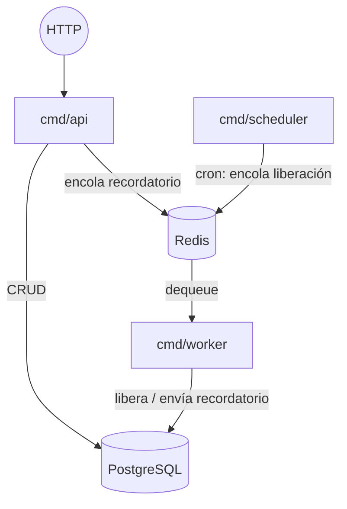
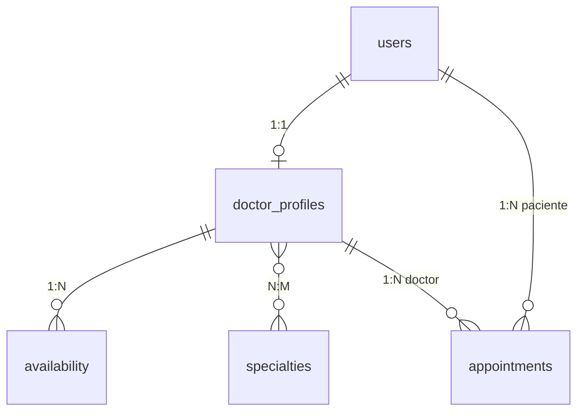
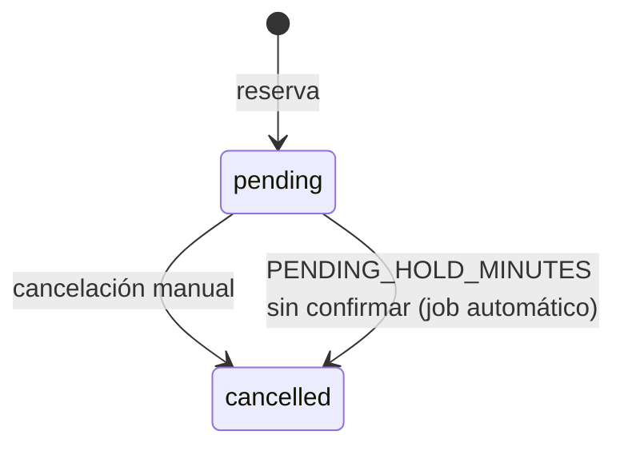

# citas-api

[](https://github.com/Smithh15/citas-api/actions/workflows/ci.yml)

Backend de un sistema de reservas de citas médicas, escrito en Go.

El objetivo del proyecto no es el CRUD: es resolver correctamente el problema de
**concurrencia** que aparece en cualquier sistema de reservas — que dos pacientes
no puedan quedarse con el mismo cupo cuando reservan al mismo tiempo — y hacerlo
con garantías del motor de base de datos, no con locks en memoria de la
aplicación.

---

## Tabla de contenidos

- [El problema central](#el-problema-central)
- [Stack](#stack)
- [Arquitectura](#arquitectura)
- [Modelo de datos](#modelo-de-datos)
- [Ciclo de vida de una cita](#ciclo-de-vida-de-una-cita)
- [Endpoints](#endpoints)
- [Cómo levantarlo](#cómo-levantarlo)
- [Tests](#tests)
- [Decisiones técnicas](#decisiones-técnicas)
- [Limitaciones conocidas](#limitaciones-conocidas)

---

## El problema central

Dos pacientes abren la agenda del mismo doctor y ven el cupo de las 8:00 libre.
Ambos presionan "reservar" en el mismo instante. ¿Qué pasa?

La respuesta ingenua es comprobar disponibilidad y después insertar:

```
1. SELECT ... ¿está libre el cupo?  -> sí
2. INSERT la cita
```

Entre el paso 1 y el paso 2 hay una ventana en la que otra petición puede haber
insertado ya. El resultado es una doble reserva: dos pacientes citados a la
misma hora con el mismo doctor.

**La solución de este proyecto** es mover la garantía a PostgreSQL, mediante un
índice único parcial:

```sql
CREATE UNIQUE INDEX idx_unique_active_slot
    ON appointments (doctor_id, slot_start)
    WHERE status IN ('pending', 'confirmed');
```

Y reservar con `INSERT ... ON CONFLICT DO NOTHING`: si el índice choca, Postgres
no inserta, la aplicación detecta que no volvió ninguna fila y responde
`409 Conflict`.

Es **parcial** (`WHERE status IN (...)`) a propósito: con un `UNIQUE` normal, una
cita cancelada bloquearía ese horario para siempre. Al restringir la unicidad a
las citas activas, cancelar libera el cupo automáticamente, sin borrar la fila
— se conserva el histórico, que en un dominio médico importa.

### Verificación

No es una afirmación teórica. El repositorio incluye un test de integración que
dispara **30 peticiones concurrentes** al mismo cupo contra una base de datos
real:

```bash
go test ./... -run ConcurrentRequests -tags=integration -race -v
```

Resultado: exactamente un `201 Created`, veintinueve `409 Conflict`, y una sola
fila en la tabla.

---

## Stack

| Componente | Tecnología | Motivo |
|---|---|---|
| Lenguaje | Go | Concurrencia como primitiva del lenguaje |
| HTTP | Gin | Middlewares y binding con validación declarativa |
| Base de datos | PostgreSQL | Índices parciales, `generate_series`, tipos `ENUM` |
| Acceso a datos | pgx + sqlc | SQL escrito a mano, con código Go tipado generado |
| Cola de trabajos | asynq (sobre Redis) | Tareas periódicas y diferidas |
| Migraciones | golang-migrate | Esquema versionado y reversible |
| Auth | JWT (golang-jwt) | Sin estado de sesión en servidor |
| Documentación | swaggo | OpenAPI generado desde el código |
| Tests | testify + httptest | Unitarios con mocks, integración contra Postgres real |

**Por qué sqlc y no un ORM:** el núcleo del proyecto es controlar exactamente qué
SQL se ejecuta — `ON CONFLICT` sobre un índice parcial, `generate_series`,
`UPDATE` con condición de estado. Un ORM abstraería justo lo que aquí hay que
demostrar. sqlc da lo mejor de ambos mundos: SQL explícito, y funciones Go
tipadas generadas a partir de él.

---

## Arquitectura

Tres binarios independientes que comparten el mismo código de dominio:

```
cmd/api        -> servidor HTTP (peticiones de usuarios)
cmd/worker     -> procesa tareas de la cola
cmd/scheduler  -> encola tareas periódicas (cron)
```

Están separados a propósito. Si el worker viviera dentro del proceso de la API:

- no se podrían escalar por separado (varias instancias de API, una de worker);
- un trabajo pesado le robaría CPU a las peticiones HTTP de los usuarios.



### Estructura de carpetas

```
cmd/
  api/          punto de entrada del servidor HTTP
  worker/       punto de entrada del worker de asynq
  scheduler/    punto de entrada del scheduler de asynq
internal/
  auth/         hash de contraseñas y emisión/validación de JWT
  config/       carga de variables de entorno
  db/           conexión a Postgres y Redis
    queries/    consultas SQL (fuente para sqlc)
    sqlc/       código generado — no editar a mano
  handlers/     handlers HTTP
  mailer/       interfaz de envío de correo
  middleware/   autenticación y autorización
  tasks/        definición y handlers de tareas en segundo plano
migrations/     migraciones SQL versionadas
```

---

## Modelo de datos



| Tabla | Rol |
|---|---|
| `users` | Cuenta y credenciales. Rol: `patient`, `doctor` o `admin` |
| `doctor_profiles` | Datos profesionales, duración por defecto del cupo |
| `specialties` / `doctor_specialties` | Especialidades, en relación muchos a muchos |
| `availability` | Franjas semanales recurrentes (día de la semana + horario) |
| `appointments` | Citas, con el índice único parcial que garantiza la exclusión |

**La disponibilidad es un patrón semanal, no fechas concretas.** Un doctor declara
"lunes de 8:00 a 12:00" una vez, en lugar de generar filas para cada lunes futuro.
Los cupos concretos se calculan al momento de consultarlos, con `generate_series`,
descartando los ya ocupados en la misma consulta.

---

## Ciclo de vida de una cita



- **Cancelación:** solo el paciente dueño de la cita o un administrador, y no
  dentro de `MIN_CANCELLATION_HOURS` previos a la cita.
- **Liberación automática:** un job periódico cancela las citas que llevan más de
  `PENDING_HOLD_MINUTES` sin confirmar. El criterio es el tiempo desde que se
  creó (`created_at`), no la fecha de la cita: una cita para dentro de un mes
  también puede estar abandonada hoy.
- **Recordatorio:** al reservar se agenda una tarea diferida para 24 h antes de la
  cita. Al ejecutarse comprueba el estado actual — si la cita se canceló entre
  medias, no envía nada.

> Los estados `confirmed` y `completed` existen en el esquema pero no tienen
> transición implementada todavía — ver [Limitaciones conocidas](#limitaciones-conocidas).

---

## Endpoints

| Método | Ruta | Acceso | Descripción |
|---|---|---|---|
| `GET` | `/health` | público | Estado del servicio y de Postgres/Redis |
| `POST` | `/auth/register` | público | Registro (crea el perfil de doctor si aplica) |
| `POST` | `/auth/login` | público | Devuelve el JWT |
| `GET` | `/me` | autenticado | Datos del usuario del token |
| `POST` | `/doctor/availability` | rol `doctor` | Declara una franja semanal |
| `GET` | `/appointments/available` | autenticado | Cupos libres de un doctor en una fecha |
| `POST` | `/appointments` | autenticado | Reserva un cupo |
| `PATCH` | `/appointments/:id/cancel` | dueño o `admin` | Cancela una cita |
| `GET` | `/swagger/index.html` | público | Documentación interactiva |

Documentación completa con esquemas de petición y respuesta en `/swagger/index.html`
con el servidor levantado.

---

## Cómo levantarlo

**Requisitos:** Go 1.26+, Docker y Docker Compose.

```bash
git clone https://github.com/Smithh15/citas-api.git
cd citas-api

cp .env.example .env      # ajusta JWT_SECRET antes de nada serio

docker compose up -d      # PostgreSQL + Redis

export $(grep -v '^#' .env | xargs)   # exporta las variables al shell
migrate -database "$DATABASE_URL" -path migrations up

go run ./cmd/api          # http://localhost:8080
```

Para el ciclo completo, en terminales aparte:

```bash
go run ./cmd/worker
go run ./cmd/scheduler
```

### Variables de entorno

| Variable | Por defecto | Descripción |
|---|---|---|
| `APP_PORT` | `8080` | Puerto del servidor HTTP |
| `DATABASE_URL` | — | Cadena de conexión a PostgreSQL |
| `REDIS_ADDR` | `localhost:6379` | Dirección de Redis |
| `JWT_SECRET` | — | Clave de firma de los tokens |
| `MIN_CANCELLATION_HOURS` | `24` | Ventana mínima para poder cancelar |
| `PENDING_HOLD_MINUTES` | `15` | Margen antes de liberar una cita sin confirmar |

---

## Tests

```bash
go test ./...                                    # unitarios (con mocks)
go test ./... -tags=integration -race -v         # + integración (Postgres real)
```

Los tests están divididos deliberadamente:

- **Unitarios:** los handlers se prueban contra un mock de la interfaz
  `sqlc.Querier`. Rápidos, sin infraestructura.
- **Integración** (build tag `integration`): requieren PostgreSQL. La garantía de
  concurrencia vive en el motor de base de datos, así que un mock nunca podría
  demostrarla — un mock no tiene condiciones de carrera.

---

## Decisiones técnicas

**Índice único parcial en vez de bloqueo aplicativo.** Un `sync.Mutex` en Go solo
protege dentro de un proceso; en cuanto se ejecuten dos instancias de la API deja
de servir. La restricción vive en la base de datos, que es el único punto
compartido por todas las instancias.

**Cancelar en lugar de borrar.** Las citas canceladas conservan su fila. El
histórico importa en un dominio médico, y el índice parcial hace que no estorben.

**El registro devuelve token directamente.** Evita un segundo viaje al login tras
registrarse. El token es de acceso, con vigencia de 24 h; no hay refresh token —
una simplificación consciente para el alcance de este proyecto.

**El error de login no distingue casos.** Contraseña incorrecta y correo
inexistente devuelven la misma respuesta, para no convertir el endpoint en un
oráculo de qué correos están registrados.

**Fallar el recordatorio no falla la reserva.** Si no se puede encolar la tarea de
recordatorio, la cita ya se creó y eso es lo que le importa al paciente: se
registra el fallo y se responde `201`.

**Distinción entre errores reintentables y definitivos.** En las tareas en segundo
plano, un fallo de base de datos se propaga para que asynq reintente con backoff;
un payload corrupto se marca con `asynq.SkipRetry`, porque reintentarlo nunca
funcionaría.

**Zona horaria explícita.** Las franjas de disponibilidad se guardan como `TIME`
sin zona y se anclan a `America/Bogota` al calcular los cupos. Sin ese anclaje,
PostgreSQL las interpreta como UTC y los horarios se desplazan cinco horas.

---

## Limitaciones conocidas

Cosas que un sistema en producción necesitaría y este proyecto no implementa:

- **`confirmed` y `completed` existen en el esquema pero no se usan.** El
  `ENUM appointment_status` los contempla desde el diseño inicial, y el índice
  único parcial (`WHERE status IN ('pending', 'confirmed')`) ya los tiene en
  cuenta — agregar más adelante un endpoint que mueva una cita a `confirmed` no
  requeriría tocar la garantía de concurrencia, solo agregar la transición. Hoy
  el único flujo implementado es `pending → cancelled`, manual o automático.
- **El registro de un doctor no es transaccional.** Crear el usuario y su perfil
  son dos `INSERT` separados; si el segundo falla, queda un usuario sin perfil.
- **El envío de correo solo escribe en el log.** `LogMailer` implementa la
  interfaz `Mailer`; sustituirlo por SMTP o un proveedor real es cambiar una línea
  en `cmd/worker`.
- **La duración del cupo está fijada a 30 minutos** al reservar, en lugar de leer
  `default_slot_minutes` del doctor.
- **Sin refresh tokens, sin rate limiting, sin paginación** en los listados.
- **Las respuestas devuelven los structs generados por sqlc** en lugar de DTOs
  propios, así que algunos campos temporales se serializan en un formato poco
  amigable.

---

## Licencia

MIT — ver [LICENSE](LICENSE).
